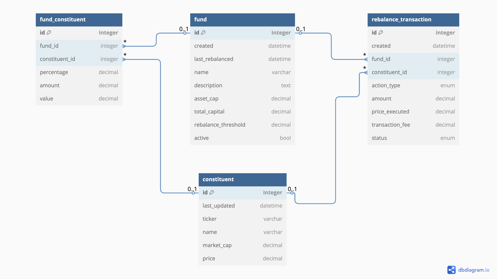

# Crypto Index Fund Balancer

## Part 1
This repository contains a full-stack app designed to balance a crypto index fund with asset caps. It includes a FastAPI backend for calculating fund allocations, a React frontend for user interaction, and automated re-balancing logic.

## Getting Started

- Clone the repository from Github
- Ensure that you have Docker installed
- Execute `docker-compose up --build`
- The application's frontend can be accessed at the following URL: http://localhost:3000/

## Part 2
### Entity Relationship Diagram



<details>
  <summary>dbdiagram.io code</summary>
  
  ```js
  Table fund {
      id integer [primary key]
      created datetime
      last_rebalanced datetime
      name varchar
      description text
      asset_cap decimal
      total_capital decimal
      rebalance_threshold decimal // % deviation that triggers rebalancing
      active bool
  }

  Table constituent {
      id integer [primary key]
      last_updated datetime
      ticker varchar
      name varchar
      market_cap decimal
      price decimal
  }

  // junction table between fund and constituent (many-to-many relationship)
  Table fund_constituent {
      id integer [primary key]
      fund_id integer
      constituent_id integer
      percentage decimal
      amount decimal
      value decimal
  }

  Table rebalance_transaction {
      id integer [primary key]
      created datetime
      fund_id integer
      constituent_id integer
      action_type enum // buy/sell
      amount decimal
      price_executed decimal
      transaction_fee decimal
      status enum // pending/completed/failed
  }

  // Table relationships
  Ref: fund_constituent.fund_id > fund.id
  Ref: fund_constituent.constituent_id > constituent.id
  Ref: rebalance_transaction.fund_id > fund.id
  Ref: rebalance_transaction.constituent_id > constituent.id
  ```
</details>

### Scheduler Flow of Events
1. #### Update price data

    - Fetch latest price data for all constituents from external APIs
    - Update the constituent table with current prices
    - Calculate the updated market capitalizations


2. #### Evaluate fund status 

    - for each active fund:
        - Calculate updated percentage allocation in the fund for each constituent based on new prices
        - Calculate the deviation between the percentages and the updated percentages for each constituent
        - Calculate total deviation across the fund

3. #### Determine rebalance necessity

    - Mark fund for rebalancing if:
        - any constituent's deviation exceeds the fund's rebalance threshold
        - the total deviation across the fund exceeds the fund's rebalance threshhold
        - last_rebalanced exceeds maximum time between rebalances

4. #### Execute rebalancing (for funds that need it)

    - Apply the index fund rebalancing algorithm to recalculate the percentages, amounts and values
    - For each constituent requiring adjustment:
        - Calculate the exact buy/sell amount needed
        - Create a new rebalance_transaction table record
        - Execute transactions through exchange API
        - Update transaction status
    - Update fund's last_rebalanced_date


5. #### Communicate changes

    - Send updates where needed through APIs, websockets, etc.
    